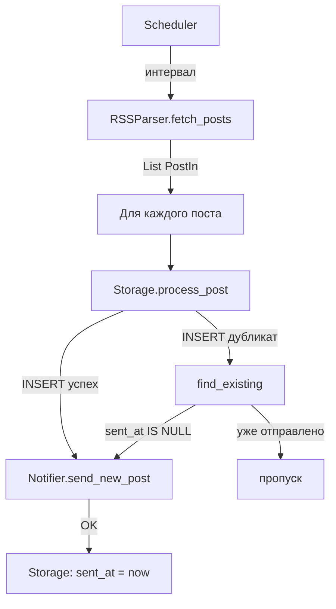

# FeedParsing (RSS → Telegram)

Периодический опрос RSS-ленты новостного сайта и отправка уведомлений в Telegram при появлении новых новостей.

## Общая информация

| Требование | Как сделано |
|------------|-------------|
| Схема взаимодействия компонентов | Ниже: текст + Mermaid |
| Модели данных (Pydantic / SQLAlchemy) | `PostIn` / `PostOut` (Pydantic), `PostRow` (SQLAlchemy) в `app/models.py`, `app/db.py` |
| Алгоритм дедупликации | Раздел 'Дедупликация и хранение состояний' |
| Каркас: `RSSParser`, `Notifier`, `Storage` | `app/rss_parser.py`, `app/notifier.py`, `app/storage.py` — разделение по слоям; методы реализованы (не `pass`), чтобы выполнялось требование «код запускается» |
| Ключи в `.env` | `.env.example`, приложение читает переменные при старте |


## Схема взаимодействия

**Роли компонентов**

- **Scheduler (APScheduler)** — по таймеру каждые `POLL_INTERVAL` секунд запускает один цикл опроса.
- **RSSParser** — загружает ленту по `RSS_URL`, парсит записи, считает `content_hash`, возвращает список `PostIn`.
- **Storage** — пишет посты в SQLite (SQLAlchemy), обрабатывает ошибки уникальности, выставляет `sent_at` после успешной отправки.
- **Notifier** — вызывает Telegram Bot API (`sendMessage`).

**Поток данных**



## Модели данных

| Слой | Сущность | Поля |
|------|----------|------|
| Обмен между слоями | `PostIn` / `PostOut` (Pydantic) | `source`, `title`, `link`, `published_at`, `content_hash`; в `PostOut` дополнительно `id`, `sent_at` |
| Персистентность | `PostRow` (SQLAlchemy) | `title`, `link`, `published_at`, `content_hash`, `source`, `created_at`, `sent_at` |


## Дедупликация и хранение состояний

В системе реализован механизм **устойчивого кэширования** на базе SQLite. База данных выступает не только хранилищем, но и основным «фильтром» дубликатов, что делает процесс надежным при сбоях и перезапусках.

### Алгоритм работы

1.  **Генерация хеша**: Для каждой записи RSS формируется стабильный `content_hash` (SHA-256) от нормализованных данных (`title`, `link`, `summary`).
2.  **Попытка записи (INSERT)**: Выполняется вставка строки в таблицу `posts`. Уникальные индексы (**Unique Constraints**) на уровне БД предотвращают появление дублей.
3.  **Обработка состояний**:
    * **Новый пост**: Если вставка успешна, вызывается `Notifier`. После успешной отправки в БД фиксируется метка `sent_at`.
    * **Дубликат**: Если при вставке возникает ошибка уникальности (`IntegrityError`), система проверяет поле `sent_at`. Если оно пустое (например, произошел сбой сети после записи, но до отправки), бот совершит повторную попытку. Если заполнено — пост игнорируется.

### Почему выбран SQLite вместо In-memory (RAM/Redis)?

* **Устойчивость к перезапуску**: Состояние не теряется при рестарте сервиса или обновлении кода.
* **Простота развертывания**: Приложению не нужны внешние зависимости, достаточно одного локального файла `feed.db`.
* **Гарантия уникальности**: Транзакционность БД исключает риск отправки одного и того же поста дважды.
* **Явная семантика**: Поле `sent_at` позволяет четко отделить этап «обнаружения» от этапа «доставки».

---

### 1) Установка

```bash
python3 -m venv .venv
source .venv/bin/activate
pip install -r requirements.txt
```

### 2) Настройка окружения

Заполни в `.env` реальные `RSS_URL`, `BOT_TOKEN`, `CHAT_ID`.

### 3) Запуск

```bash
python src/main.py
```
Из корня репозитория

## Переменные окружения

| Переменная | Назначение |
|------------|------------|
| `RSS_URL` | URL RSS-ленты |
| `POLL_INTERVAL` | Период опроса (по умолчанию 60) |
| `BOT_TOKEN` | Токен бота |
| `CHAT_ID` | `chat_id` или id канала вида `-100...` |
| `DATABASE_URL` | DSN SQLAlchemy; по умолчанию `sqlite:///./feed.db` |
